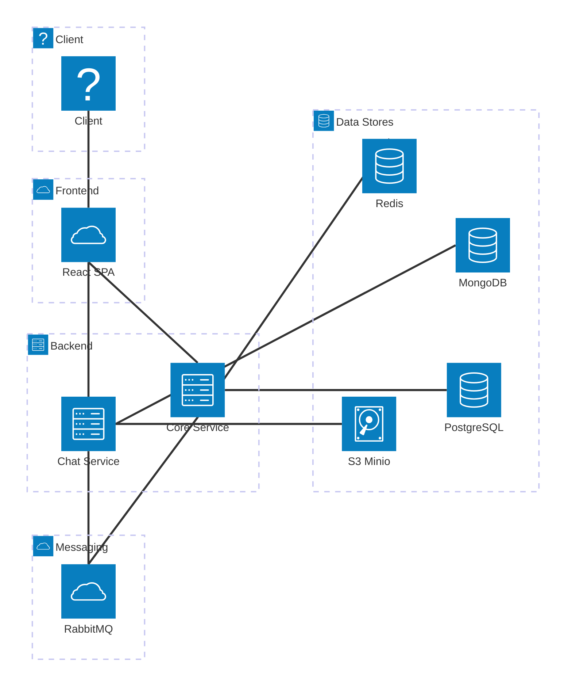

# System Architecture Diagram

```mermaid
architecture-beta
  %% Clients
  group client(users)[Client]
    service clientApp(user)[Client] in client

  %% Frontend
  group frontend(cloud)[Frontend]
    service reactSpa(cloud)[React SPA] in frontend

  %% Backend
  group backend(server)[Backend]
    service coreService(server)[Core Service] in backend
    service chatService(server)[Chat Service] in backend

  %% Data stores
  group data(database)[Data Stores]
    service postgres(database)[PostgreSQL] in data
    service mongodb(database)[MongoDB] in data
    service redis(database)[Redis] in data
    service s3(disk)[S3 Minio] in data

  %% Messaging
  group mq(cloud)[Messaging]
    service rabbitmq(cloud)[RabbitMQ] in mq

  %% Connections
  clientApp:B -- T:reactSpa
  reactSpa:B -- T:coreService
  reactSpa:B -- T:chatService

  coreService:R -- L:postgres
  coreService:B -- T:redis
  coreService:B -- T:rabbitmq

  chatService:R -- L:mongodb
  chatService:R -- L:s3
  chatService:B -- T:rabbitmq
```