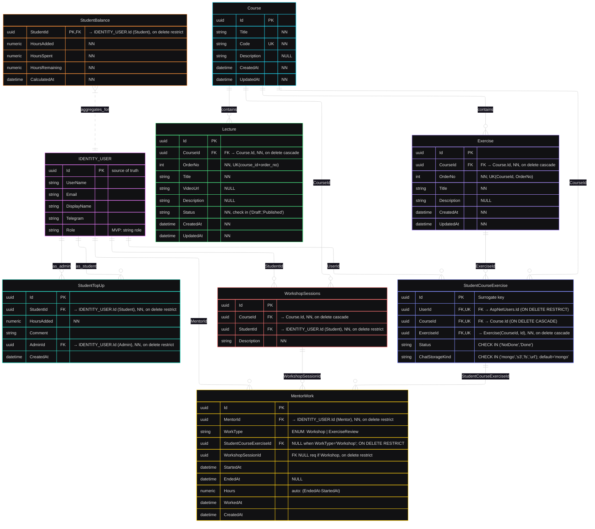

# WorkshopCode_ER_MVP
**Version:** v2
**Date:** 2025-09-24  
**Status:** In Review  

## Change Log  
- v2 (2025-09-24) — Изменено:
    - UserData заменена IDENTITY_USER (виртуальная таблица —  Identity-managed tables)
    - слит ExerciseChat в StudentExercise
	- слит Journal в StudentExercise
    - добавлена WorkshopSessions — описание воркшопа и связь с конкретным Course
    - описаны основные аттрибутвы полей (ограничения / FK / UK / NN / Null)
- v1 (2025-09-12) —  DRAFT версия.  